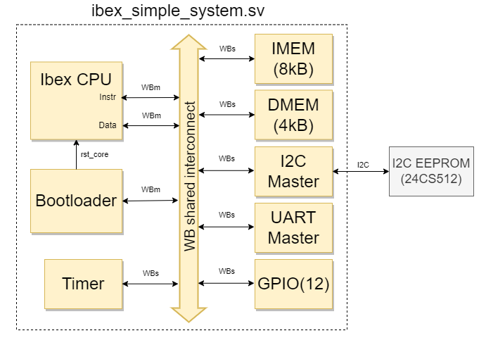

# Minimal RISC-V Microcontroller

Simple microcontroller based on the [Ibex core](https://github.com/lowRISC/ibex)
<p align="center">
  
</p>

---

## Features

- RV32IM instruction set
- 8 kB SRAM instruction memory (IMEM)
- 4 kB SRAM data memory (DMEM)
- I2C bootloader
- Peripherals:
  - I2C master
  - Programmable timer
  - 12 GPIOs
- All peripherals suport interrupts

---

## Peripherals
|Peripheral|Base Address|
|----------|------------|
|IMEM|0x80000000|
|DMEM|0x90000000|
|GPIO|0x40000000|
|I2C|0x30000000|
|PIT|0x20000000|

---


## RTL Simulation

Before simulation, PDK files must be added MANUALY to `rtl/pdk` directory (see [rtl/README.md](rtl/README.md#pdk)) and the processor software has to be compiled (see [sw/README.md](sw/README.md#Compiling)).

#### Cadence Xcelium
##### Lab PC
Start simulation by executing `xrun_sim_run.sh` script in the terminal:
```bash
./script/xrun_sim_run.sh -gui -t full_peripheral
```
Restore waveform configuration with File -> Source Command Script -> Select `restore.tcl.svcf`.

If any RTL source files changed or processor software is recompiled – reload simulator (Simulation -> Reinvoke Simulator).

#### Verilator + gtkWave

##### Ubuntu (Linux)
Install the tools by running the following command in the terminal:
```bash
sudo apt-get install -y verilator gtkwave
```
Start simulation by executing `run_sim_verilator.sh` script in the terminal:
```bash
./script/verilator_sim_run.sh
```
Check simulation waveforms by opening `gtkWave.gtkw` or `output.vcd` files using a waveform viewer such as GTKWave.

If any RTL source files changed or processor software is recompiled – rerun simulation script and reload GTKWave waveforms (File -> Reload Waveform or Ctrl+Shift+R).

##### Windows

The same commands that are used for Ubuntu can be used under Windows
by using the Windows Subsystem for Linux (WSL).
Activate it and install Ubuntu by following the guide
[here](https://ubuntu.com/tutorials/ubuntu-on-windows#1-overview).


## FPGA Implementation

Hardware simulation has been tested on a BASYS3 FPGA using the Vivado design suite.

##### Program FPGA

1. Create a project in Vivado select BASYS3 board.
2. Upload RTL files from `rtl/` "Add Sources" -> Select "Add or create design sources" -> "Add Directories" use the following order:
    1. `include/`
    2. `pdk/`
    3. `primitives/`
    4. `core/`
    5. `peripherals/`
    6. `wb/`
    7. `rtl/ibex_simple_system.sv` (use "Add Sources" for this)
    8. `fpga/`
3. Add constraint file: "Add Sources" -> Select "Add or create constraints" -> "Add Files" [FPGA_constraints/Basys-3-Master.xdc](FPGA_constraints/Basys-3-Master.xdc).
4. Put these commands in "Tcl Console"
```bash
set_property verilog_define FPGA_Implementation [current_fileset]
set_property is_global_include true [get_files  <path to repo>/MLAB_riscv_mcu-wishbone/rtl/include/project_defs.svh]
```
5. Run Synthesis, Implementation and Generate Bitstream.
6. Open Hardware Manager -> Auto Connect -> Program Device
7. Program the EEPROM (see [sw/README.md](sw/README.md#Programming)) and plug it into PMOD JA connector.

To save the FPGA configuration to the BASYS3's non-volatile memory (so you don't have to reprogram it after every power cycle), refer to the official [Basys 3 Programming Guide](https://digilent.com/reference/learn/programmable-logic/tutorials/basys-3-programming-guide/start) from Digilent.

