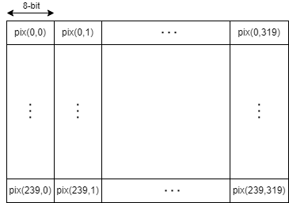

# Image Processing Accelerator 

## Student Lab Guide

| | |
|---|---|
| **Module** | `rtl/peripherals/sobel_acc.sv` |
| **Testbenches** | `tb/sobel_acc_tb.sv` (isolated), `tb/sobel_full_tb.sv` (full system) |
| **Firmware** | `sw/ibex/test/sobel_acc/` |

---

## 1. Overview

The image processing accelerator reads bytes from the Input FIFO, processes them, and writes results to the Intermediate FIFO. Processing begins as pixels arrive, meaning you shouldn't buffer a full frame.

The pixels of an image are streamed from the top-left corner of an image in rows from left to right (see ilustration below)

<p align="center">
  
</p>

The CPU configures and starts the accelerator via the Wishbone CSR interface. In `auto_start` mode the pipeline runs frame-after-frame without CPU involvement after initial setup.

A reference implementation is provided that performs pixel inversion (`output = ~input`, `algo_sel=0`). **Your task is to replace this with Sobel edge detection by implementing the `algo_sel=1` branch in `rtl/peripherals/sobel_acc.sv`**

The accelerator sits between the Input FIFO and the intermediate FIFO. It reads from the FIFO, applies processing and writes to the intermediate FIFO. The CPU only touches the CSR registers.

---

## 2. The Sobel Algorithm

Sobel edge detection estimates the gradient of pixel intensity at each point in the image. A large gradient indicates an edge.

For each pixel at position (x, y), two 3×3 convolution kernels are applied:

```
        Gx (horizontal)        Gy (vertical)

       -1   0  +1            +1  +2  +1
       -2   0  +2             0   0   0
       -1   0  +1            -1  -2  -1
```

**Calculation example**
Each kernel is applied to the 3×3 neighbourhood of pixels surrounding (x, y). 
If pixels are enumerated in the following order:
```
   s11 s12 s13
   s21 s22 s23
   s31 s32 s33
```
Then to find horizontal edges:
```
|Gx| = -1*s11 + 1*s13 - 2*s21 + 2*s23 - 1*s31 +1*s33
```
To find vertical edges:
```
|Gy| = 1*s11 + 2*s12 + 1*s13 - 1*s31 - 2*s32 - 1*s33
```
The results are combined to give the gradient magnitude:
```
   G = |Gx| + |Gy|
```

The output pixel G should be clamped to [0, 255]. You may look into how the edge-detection algorithm works but for the hardware implementation you only need to think how to implement the above three equations in hardware. 

A problem you may realize soon is that you do not have the required 3x3 kernel for the pixels on the border of the frame such as pix(0,0), pix(0,1). For the initial implementation you don't have to care about it but once you have it running consider **mirroring** for these border pixels - the pixel one step outside the left edge mirrors the pixel one step inside.

---

## 3. Architecture consideration
Before writing any RTL code, you need a design. You need
to understand the problem and consider possible implementations.

- How much data will the hardware accelerator buffer internally?
- How fast does your accelerator have to process pixels so that the FIFOs don't start blocking?
- How many states does the FSM in your accelerator need?

...

Draw a block diagram showing the datapath you have designed and develop an FSM diagram for your accelerator.


## 4. Simulation

### 4.1 Isolated Testbench (`sobel_acc_tb`)

When you first start developing the edge detection algorithm inside the `sobel_acc` accelerator you will want to test in in isolation. For this reason `tb/sobel_acc_tb.sv` is provided.

The testbench emulates both FIFOs: it feeds the camera FIFO one pixel (byte) at a time and captures every write to the intermediate FIFO output into a shadow array. After the frame completes the shadow is verified against the golden model and written out as a P2 ASCII PGM to `tb/out_images/`.

**Workflow:**
1. Set `SRC_IMAGE` in `tb/sobel_acc_tb.sv` to one of the PGMs in `tb/src_images/`.
2. Run the testbench (command below).
3. Open the matching file in `tb/out_images/` for visual verification.

```bash
./script/xrun_sim_sobel.sh
```

### 4.2 Full System Testbench (`sobel_full_tb`)

Instantiates the complete `ibex_simple_system` SoC. The CPU firmware (`sw/ibex/test/sobel_acc/`) runs on the Ibex core - it writes `SOBEL_CTRL=1`, polls `FRAME_COUNT`, then raises GPIO0 to signal completion. The testbench forces `fifo_din`/`fifo_wr_en` (tied off in RTL) to inject one pixel byte at a time into the camera FIFO. Output pixels are captured by shadowing `dut.inter_wr_en`/`dut.inter_din` as sobel_acc writes to the intermediate FIFO. On GPIO0 going high the testbench verifies the shadow against the golden model and writes a PGM.

**Workflow:**
1. Build the firmware:
```bash
cd sw/ibex/test/sobel_acc && make clean && make all
```
2. Run the full system testbench (command below).
3. Inspect the output PGM in `tb/out_images/`.

```bash
./script/xrun_sim_run.sh -t sobel_full
```

You can also run it with GUI for visual debugging:
```bash
./script/xrun_sim_run.sh -t sobel_full -gui
```

---

## 5. Firmware (CPU Side)

The CPU program is in `sw/ibex/test/sobel_acc/core/src/main.c`. It:

1. Enables GPIO0 as output.
2. Writes `SOBEL_CTRL = 0x1` to set `auto_start` with `algo_sel=0` (inversion reference).
3. Polls `SOBEL_FRAME_COUNT` until a frame completes.
4. Raises GPIO0 to signal the testbench.

When you implement Sobel, change `SOBEL_CTRL = 0x3` (`auto_start=1`, `algo_sel=1`) and any other updates you may need.

Build:

```bash
cd sw/ibex/test/sobel_acc
make clean && make all
```

---

## 6. Design Hints

- Data arrives one pixel (8 bits) per clock cycle from the camera FIFO. The Sobel kernel needs three rows simultaneously - you need internal **line buffers** (one per row) to hold rows N-1 and N while row N+1 streams in. Each line buffer is 320 bytes.
- A pipelined datapath can produce one output pixel per cycle once the pipeline is filled, even if each individual computation takes multiple stages.
- The Sobel kernel values are only ±1 and ±2, so all multiplications reduce to additions and a single left shift.
- Consider image borders carefully - your design must handle boundary pixels without reading out-of-bounds addresses. Mirror the outermost row/column in the line buffers.
- Output is also one byte per cycle via `out_wr_en`/`out_din` - no packing into wider words is required. Stall the entire pipeline (both input and output) when `out_full` is asserted.

---


## 7. Accelerator Interface

### 7.1 Wishbone CSR Register Map

Base address: `0x6000_0000`.

| Offset | Name | Access | Description |
|---|---|---|---|
| `0x00` | `CTRL` | R/W | bit[0]: `auto_start` - restart automatically on `frame_ready`.<br>bit[1]: `algo_sel` - 0: pixel inversion (reference), 1: Sobel (student impl). |
| `0x04` | `STATUS` | RO | bit[0]: `busy`.<br>bit[1]: `done` - high for one cycle after a frame completes.<br>bit[2]: `error` - unused; assign during development for recovery. |
| `0x08` | `FRAME_COUNT` | RO | Completed frame counter, wraps at 2³². CPU polls to verify pipeline liveness. |

### 7.2 Camera FIFO Port Interface

The camera FIFO (`fifo_fwft`, `DATA_WIDTH=8`, `DEPTH_WIDTH=10`) carries one grayscale pixel per word. The OV7670 delivers pixels one byte at a time, so this matches the camera's native output directly. The FIFO is First Word Fall-Through: `fifo_dout` is valid as soon as `fifo_empty=0`, with no read strobe required to present the first byte. Asserting `fifo_rd_en` advances to the next pixel on the following cycle.

| Signal | Direction | Width | Description |
|---|---|---|---|
| `fifo_empty` | Input | 1 | FIFO empty. `fifo_dout` is not valid when high. Stall the datapath. |
| `fifo_dout` | Input | 8 | One grayscale pixel. Valid whenever `fifo_empty=0`. |
| `fifo_rd_en` | Output | 1 | Read advance. Assert for one cycle to consume the current pixel and present the next. |

### 7.3 Intermediate FIFO Port Interface

Processed pixels are written one byte at a time to the intermediate FIFO, which feeds the compression accelerator downstream. The accelerator must stall both reads and writes when `out_full` is asserted.

| Signal | Direction | Width | Description |
|---|---|---|---|
| `out_wr_en` | Output | 1 | Write enable. Assert for one cycle to push one processed pixel. |
| `out_din` | Output | 8 | One processed grayscale pixel. Must be valid when `out_wr_en=1`. |
| `out_full` | Input | 1 | Intermediate FIFO full. Do not assert `out_wr_en` when high; also stop consuming from the camera FIFO. |

---