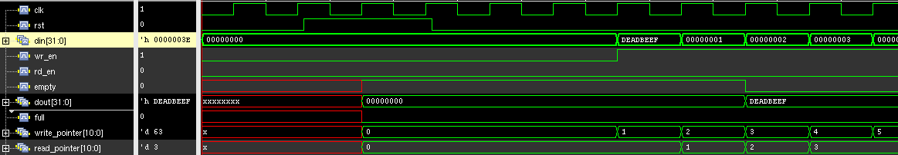
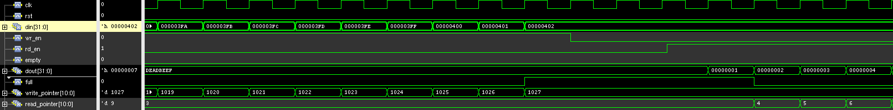

## Journal for tracking progress of the edge detection and compression assignment development

## Notes
<!-- [risk] [decision] [revisit] - tag freely -->
[revisit] Vivado will not infer BRAM from the IHP behavioral SRAM memories (IMEM and DMEM) because clock is muxed, bit-level write masks are used etc. If we want to significantly increase the sizes of these CPU memories, we will need to switch to models that infer BRAM.

[revisit] `camera_fifo` behavioral sim files placed in `fpga/IP/`; to be regenerated targeting XC7Z020 before hardware bring-up. Also messy Vivado IP integration find a better way.

[decision] CPU is the supervisor, not the data mover. Pipeline runs autonomously once configured. CPU role: configuration, mode switching, error recovery, liveness monitoring via FRAME_COUNT.

[decision] Input side uses a 1024×32-bit FWFT FIFO instead of a full frame buffer. The accelerator begins processing pixels as they arrive. FIFO depth covers ~3 lines, enough for Sobel line buffer fill latency. BRAM B is kept as a full frame buffer for the compression accelerator.

[decision] 32-bit wide data path (4 pixels/word) throughout, matching Xilinx BRAM/FIFO primitive widths.

# Edge detection

## Register Map (base: 0x6000_0000, sobel_size = 0x0C)

| Offset | Name          | Access | Description |
|--------|---------------|--------|-------------|
| `0x00` | `CTRL`        | R/W    | bit[0]: `start` - manual trigger, self-clears on start. bit[1]: `auto_start` - fire automatically when `frame_ready_i` is asserted. bit[2]: `algo_sel` - 0: pixel inversion (reference), 1: Sobel (student implementation) |
| `0x04` | `STATUS`      | RO     | bit[0]: `busy`. bit[1]: `done` - held until next CTRL write. bit[2]: `frame_ready` - latched from camera IF pulse; cleared on start. bit[3]: `error` |
| `0x08` | `FRAME_COUNT` | RO     | Completed frame counter, wraps at 2^32. CPU reads to verify pipeline liveness. |

## FIFO usage
The [Camera FIFO](https://github.com/olofk/fifo/tree/master) has a one cycle `empty` signal deassertion latency. Cycle0 write to FIFO, Cycle1 wait, Cycle2 data available at the output and empty flag goes low (see image below). 


Looking at the previous image you can see the `read_pointer` increments even though `rd_en` is not asserted. This is done by the `fifo_fwft_adapter.v` to prefetch for FWFT (First Word Fall Through). FWFT means the output for read is available on the same cycle as you set `rd_en`.

When `full` goes high the last write can still be performed on that cycle (See image below).


**IMPORTANT**: The FIFO has no overflow protection — if `wr_en` is asserted while `full` is high, the write pointer wraps and silently corrupts stored data. The writer must gate `wr_en` on `full`.

Run the command below if you want to analyse FIFO behaviour yourself.
```
./script/xrun_sim_sobel.sh
```

## FIFO include files for sim (Vivado)
1. C:\Users\dovyd\dtu_chip\original_win_test\Didactic-SoC\build\fpga\basys3\didactic-basys3.gen\sources_1\ip\camera_fifo_V1\sim\camera_fifo.v
2. C:\Users\dovyd\dtu_chip\original_win_test\Didactic-SoC\build\fpga\basys3\didactic-basys3.ip_user_files\ipstatic\hdl\fifo_generator_v13_2_rfs.v
3. C:\Users\dovyd\dtu_chip\original_win_test\Didactic-SoC\build\fpga\basys3\didactic-basys3.ip_user_files\ipstatic\simulation\fifo_generator_vlog_beh.v

/home/la_v9/mlab/MLAB_MCU_edu/fpga/IP/fifo_generator_v13_2_rfs.v

## TODO
1. (DONE) Add WB slave for edge-detection accelerator subsystem
2. (DONE) Implement frame buffer memories, CSRs, pixel inversion reference
3. (DONE) Replace Frame BRAM A with streaming FIFO; simplify FSM to single RUN state
4. (DONE) Develop a testbench that exercises the subsystem in isolation
5. (DONE) Develop full system testbench that exercises the subsystem
6. Write guide how to simulate, explain the system (what is in sobel_acc, FIFO caveats, sw for MCU)
7. Write interface to read from OV7670 and test with a real module.

## 2026-05-10
### Did
- `sobel_acc.sv`: Wishbone slave with IDLE/RUN/DONE FSM; reads from FWFT FIFO, writes 32-bit words to Frame BRAM B; `algo_sel` selects pixel inversion or Sobel stub; `auto_start` enables autonomous pipeline operation
- `bram.sv`: 32-bit wide, word-addressed (19,200 words, QVGA frame)
- `ibex_simple_system.sv`: `camera_fifo` and `u_frame_bram_b` instantiated and wired to `sobel_acc`; camera-side FIFO inputs stubbed to zero pending camera IF; `SOBEL_BASE_ADDR = 0x6000_0000` added to `project_defs.svh`

### Next
- Write isolated testbench for `sobel_acc` with behavioral FIFO stimulus
- Generate 320x240 images for the testbench.

## 2026-05-12

- Isolated testbench `sobel_acc_tb.sv` to run use `./script/xrun_sim_sobel.sh`

## 2026-05-14
### Did (FIFO Work)
- Xilinx generated FIFO with FWFT has 3 cycle latency for empty and full signals
- Chose to use an external FIFO from (https://github.com/olofk/fifo/tree/master).
- `sobel_acc_tb.sv` works.

### Next
- Usage guide for students.
- Compression accelerator.

## 2026-05-25
### Did
- Guide for developing edge detection for students in `doc/edge_detection.md`

# Compression accelerator

## 2026-05-27
### Did
- Add a top-level README
- Add `doc/compression.md` with initial ideas

### Next
- Expand the description in `doc/compression.md`
- Implement the framework for the compression part
- Look at interfacing options for Compression ACC -> FTDI converter

## 2026-06-04

### Did
- Found ftdi controller with AXI interface
- `fpga\rtl\ft2232h_tx.v`: Claude generated wrapper for simple FIFO interface to `ftdi_245fifo_top.v` instead of AXI 
- `fpga\rtl\ft2232h_tx_usage_example.v`: Claude generated instantiation example with required XDC constraints (commented text)
- Changed data bus widths to be 8-bit instead of 32-bit throughout the system. Because that's the bus width from the camera interface and for the FTDI controller.
- Isolated testbench for the compression accelerator. Generated edge-detected images with a python script. They sit in `tb/src_images` with the file name ending `*_edge`. Result is written in binary format - let the students decompress on their own.

### Next
- Complete compression testbench
- Software for Ibex for complete testbench

## 2026-06-18

### Testing FPGA-ftdi245fifo 

Testing the Claude generated example in `ftdi_test/`

RESULT: Managed to get the FPGA to send data but 1 bit would always be off

## 2026-06-24

### Testing FPGA-ftdi245fifo

Testing the repo examples `deps/ftdi_controller/RTL/fpga_ft232h_example/fpga_top_ft232h_loopback.v` and `deps/ftdi_controller/RTL/fpga_ft232h_example/fpga_top_ft232h_tx_mass.v`

Data transfer successful from the PC->FTDI->FPGA, but the FTDI MiniModule never let's the `ftdi_txe_n` signal low - never signals that it is ready to receive data for FPGA->FTDI->PC transfer

### ILA generation

1. Instantiate in RTL top level
```Verilog
ila_0 u_ila (
    .clk     ( ftdi_clk           ),   // 100 MHz onboard oscillator - always free-running at program time

    .probe0  ( ftdi_rxf_n    ),   // [0:0] RXF# : PC has data for FPGA (active low)
    .probe1  ( ftdi_txe_n    ),   // [0:0] TXE# : FT2232H can accept TX data (active low)
    .probe2  ( ftdi_oe_n     ),   // [0:0] OE#  : FPGA drives bus (active low)
    .probe3  ( ftdi_rd_n     ),   // [0:0] RD#  : FPGA reading from FT2232H (active low)
    .probe4  ( ftdi_wr_n     ),   // [0:0] WR#  : FPGA writing to FT2232H (active low)
    .probe5  ( tdata[7:0]    ),   // [7:0] low byte of AXI-stream data (RX received / TX sending)
    .probe6  ( tvalid        ),   // [0:0] AXI-stream valid
    .probe7  ( tready        )    // [0:0] AXI-stream ready
);
```


2. Create the IP in Vivado
```tcl
create_ip -name ila -vendor xilinx.com -library ip -version 6.2 -module_name ila_0

set_property -dict {
    CONFIG.C_NUM_OF_PROBES 8
    CONFIG.C_DATA_DEPTH    1024
    CONFIG.C_PROBE0_WIDTH  1
    CONFIG.C_PROBE1_WIDTH  1
    CONFIG.C_PROBE2_WIDTH  1
    CONFIG.C_PROBE3_WIDTH  1
    CONFIG.C_PROBE4_WIDTH  1
    CONFIG.C_PROBE5_WIDTH  8
    CONFIG.C_PROBE6_WIDTH  1
    CONFIG.C_PROBE7_WIDTH  1
} [get_ips ila_0]

generate_target all [get_ips ila_0]
```

3. After uploading bitstream setup the ILA close and re-open the Hardware Manager, ILA Status, settings, trigger setup and capture setup windows should appear.

## 2026-06-29

TASK: Run the Claude generated example and observe the `ftdi_txe_n` signal on ILA to see it going down.
RESULT: The Claude generated example runs but for some reason get some corrupted bytes in every transmission

Going back to the `deps/ftdi_controller/RTL/fpga_ft232h_example/fpga_top_ft232h_loopback.v` example
Through the ILA all the data can be seen on tdata[7:0] meaning PC->FPGA transmission is successful, but it never goes back.

## 2026-07-07
### Did
- Shorted CN2-21 and CN2-22 to make sure SIWU is always 1. This makes loopback work but there is always an extra 0 in the beginning. Added an extra ground wire and Fable generated I/O xdc constraints.
- Chased the sync-245 byte errors to the end: 1 byte lost per 512 B USB packet, at ANY data rate (paced 6.25 MB/s test = same loss as full rate). ILA shows the FPGA correctly re-presents the byte after each TXE# pulse, but only for one 16.7 ns window - the chip misses it (8 ns setup can't be met without clock deskew). Full findings in `ftdi_test/README.md` Status.
- MMCM deskew + registered-output fix prototyped (`ftdi_test/rtl/fpga_top_ft232h_loopback_mmcm.v`) but shelved to keep the teaching example and upstream repo simple/untouched.

### Next
- Decide the FPGA->PC transport for the camera stream: (a) adopt the MMCM + `CHIP_DRIVE_AT_NEGEDGE=1` + -90 deg phase fix in `fpga/rtl/ft2232h_tx.v` (~40 MB/s, modifies IP), or (b) write a small FT245 **async** FIFO TX module (~8 MB/s, relaxed timing, no 60 MHz clock domain) - leaning (b), rate is sufficient.
- Then connect the compression accelerator output to the chosen FTDI TX path and rerun `ftdi_rx_verify.py` as the acceptance test.