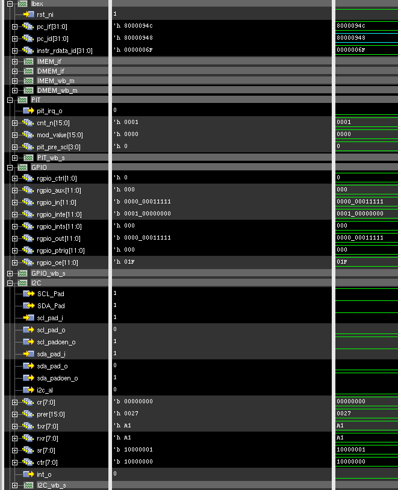
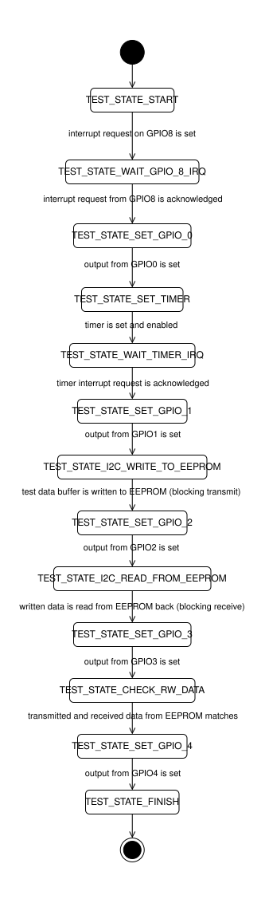

# Full peripheral (excluded UART as of 02.09.25) test
## Description
Testing:
- GPIO peripheral interrupt request and outputs;
- TIMER interrupt request and configuration;
- I2C MASTER blocking transmit and receive.
## Successfull simulation test end state
All five GPIO's indicate successfull test execution. The test chain starts on `GPIO_PIN_8` interrupt request to Core. The simulation end state is given bellow (as of 03.09.25).
The Core stalls on the infinite loop command that is on the `TEST_STATE_FINISH` state:
```asm
while (DEBUG_WHILE_TEST_SUCCESS);
80000948:	0000006f          	j	80000948 <main+0x16c>
```

## Test state diagram
