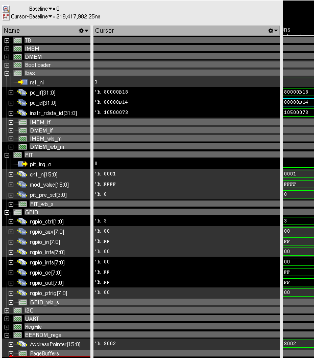
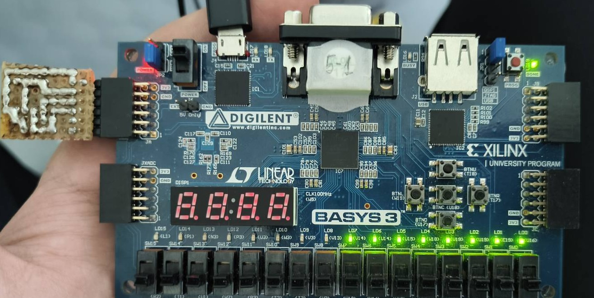
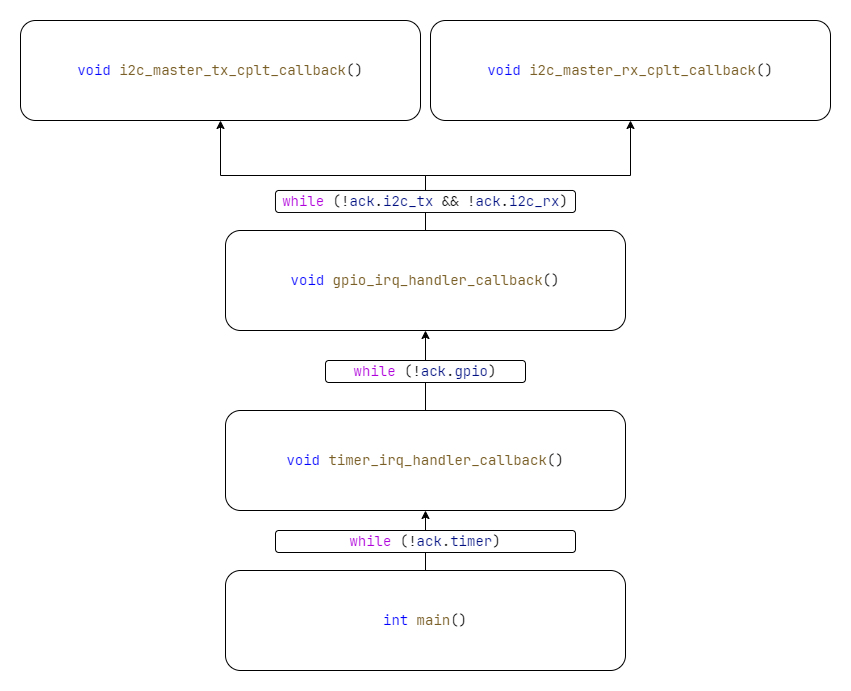

# Nested interrupts test
## Testbench
### GPIO output meanings
GPIO PIN output| Meaning
--- | ---
0 | GPIO interrupt acknowledged
1 | I2C transmit to EEPROM called
2 | I2C transmit to EEPROM completed
3 | I2C receive completed
4 | I2C transmit-receive buffer data is matching
5 | GPIO handler callback exit (I2C both acknowledgements received)
6 | Timer handler callback exit (GPIO acknowledgement received)
7 | All nested interrupt stages passed successfully
### Successful test in simulation
Running without GUI:
```bash
./script/xrun_sim_run.sh -t nested_interrupts
```
Expected output:
```
xcelium> run
[SUCCESS]: test stage 0: GPIO pad 0 interrupt request acknowledged, GPIO_PINS = 000000000001
[SUCCESS]: test stage 1: I2C transmit to EEPROM called, GPIO_PINS = 000000000011
[SUCCESS]: test stage 2: I2C transmit to EEPROM completed, GPIO_PINS = 000000000111
[SUCCESS]: test stage 5: GPIO handler callback exit (I2C both acknowledgements received), GPIO_PINS = 000000100111
[SUCCESS]: test stage 6: Timer handler callback exit (GPIO acknowledgement received), GPIO_PINS = 000001100111
[SUCCESS]: test stage 7: all nested interrupt stages passed successfully, GPIO_PINS = 000011100111
[SUCCESS]: test stage 3: I2C receive completed, GPIO_PINS = 000011101111
[SUCCESS]: test stage 4: I2C transmit-receive buffer data is matching, GPIO_PINS = 000011111111
[SUCCESS]: All 8 stages of the test are passed: expected GPIO values = 000011111111, received = 000011111111
```
Running with GUI:
```bash
./script/xrun_sim_run.sh -t nested_interrupts -gui
```
Core's `PC` must be on the sleep loop, the address can vary, but it must point to the `sleep_loop` function:
```asm
80000b14 <sleep_loop>:
80000b14:	10500073          	wfi
80000b18:	ffdff06f          	j	80000b14 <sleep_loop>
```
And all 8 GPIO's must be turned on (from GPIO 0 to GPIO 7).
You can use this successful simulation end result as a reference (be wary, that `pc` address can be different, but it must be one of the `sleep_loop` assembly instructions).

### Successful test on FPGA
All 8 LED's must turned on (test last run was on 2025.08.20). If it is not, check if the `#define FPGA` is set to `1` in `core/inc/main.h`. Make clean build.

## Building test program
### Simulation
Make sure that `#define FPGA 0` (set off) in `core/inc/main.h` file and use `nested_interrupts_tb.sv` testbench file in the `tb` directory, located in project's root to run test.
### FPGA
Make sure that `#define FPGA 1` (set on) in `core/inc/main.h` file. After reset, wait a bit and trigger GPIO 8 interrupt (one of the buttons, check GPIO FPGA mappings).
The test can be rerun as multiple times as long as EEPROM has correct binaries.
## Acknowledgement hierarchy
- `main()` triggers Timer (PIT) interrupt after initial setup and goes to the `while` loop that waits for the Timer's acknowledgement.
- `timer_irq_handler_callback()` stops the timer and goes to the `while` loop that waits for the GPIO PIN 0 (or 8 on FPGA) acknowledgement.
- `gpio_irq_handler_callback()` checks if the interrupt happened on the required pin (GPIO 0 in simulation and GPIO 8 on FPGA). When the interrupt is high on the required GPIO pin, callback function calls `i2c_master_txi2c_master_tx_it()` non-blocking I2C transmit function and goes to the `while` loop that waits for the I2C transmit and receive acknowledgement.
- `i2c_master_tx_cplt_callback()` is called when the I2C transmit to EEPROM is completed (just sending 4 byte buffer). It calls `i2c_master_rx_it()` non-blocking function and acknowledges the I2C transmit (`gpio_irq_handler_callback()` waits for transmit and receive acknowledgement) and returns.
- `i2c_master_rx_cplt_callback()` is called when the I2C receive from EEPROM is completed. It acknowledges I2C receive done and checks if the received buffer bytes matches the transmitted ones and returns.
- `gpio_irq_handler_callback()` gets both acknowledgements and acknowledges itself and returns.
- `timer_irq_handler_callback()` gets the GPIO acknowledgement and before return acknowledges itself.
- `main()` receives Timer acknowledgement and returns.

## Atomic operations
**THIS CODE IN INTERRUPT REQUEST CALLBACK IS FOR TESTING PURPOSES ONLY, DO NOT USE IT AS AN EXAMPLE OF HOW TO WRITE CORRECT AND SAFE INTERRUPT REQUEST CALLBACKS!**

This section is supposed to provide in-depth knowledge of how nested interrupts are implemented and how to use them. Skip to [next section](#usage) this if this information is not relevant to you.

### Non-nested interrupts
Non-nested interrupt from the code side looks something like this:
```c
void TIMER_IRQHandler(void) {
  timer_handle *timer_handle_ptr = &g_timer_handle;
  TIMER_ACK_INT_AND_DISABLE_IRQ(timer_handle_ptr);
  timer_irq_handler(&g_timer_handle);
}
```
The `TIMER_IRQHandler()` function first acknowledges interrupt immediatelly. That is the main 'mission' of the main interrupt request function. Second, it calls the handler function and passes the global handle wich is defined somewhere in main.
When the interrupt fires, in this case Timer peripheral's interrupt, the core jumps to the vector table and goes to the interrupt request handler. When it jumps to the function, the core automatically disables global interrupts by default. The 3rd bit of Core's `mstatus` ([read more here](https://five-embeddev.com/riscv-priv-isa-manual/Priv-v1.12/machine.html#machine-status-registers-mstatus-and-mstatush)) register is cleared to `0`. Then, when the interrupt request function returns, the global interrupts to the Core are reenabled. So, by default, the Ibex core DOES NOT support nested interrupts.

### Nested interrupts
To handle nested interrupts, the atomic `CSR` (Control and Status Register) operations are needed. Ibex Core [supports nested interrupts](https://ibex-core.readthedocs.io/en/latest/03_reference/exception_interrupts.html#nested-interrupt-exception-handling) but it does not provide the actual code.
#### Critical section entry

The values of a status registers needs to backed up on the stack.
```c
uint32_t mepc_bak;
uint32_t mstatus_bak;
uint32_t mie_bak;
```
Register name | Full name | Functionality
---|---|---
`mepc` | Machine Exception Program Counter | Address of the next instruction about to be executed before interrupt
`mstatus` | Machine Status | Core's current operating state
`mie` | Machine Interrupt Enable | Mask that enables/disables individual interrupt sources.

The states of these three registers must be saved on the stack.
```c
__asm__ volatile("csrr %0, mepc" : "=r"(mepc_bak));
__asm__ volatile("csrr %0, mstatus" : "=r"(mstatus_bak));
__asm__ volatile("csrr %0, mie" : "=r"(mie_bak));
__asm__ volatile("csrsi mstatus, 0x8");   
```
First three atomic assembly instructions are *CSR Read*, that read register values to the Stack's variables.
Last command *CSR Set Immediate* set the third bit `0x8 = 0b1000` to reenable global interrupts. This means that the code after the critical section entry is interruptable by other interrupts.
#### Optional interrupt mask
There can be an option, where before reenabling global interrupts, interrupt ID's, that can interrupt the current interrupt, can be set.
```c
uint32_t mepc_bak;
uint32_t mstatus_bak;
uint32_t mie_bak;
uint32_t mie_mask;

__asm__ volatile("csrr %0, mepc" : "=r"(mepc_bak));
__asm__ volatile("csrr %0, mstatus" : "=r"(mstatus_bak));
__asm__ volatile("csrr %0, mie" : "=r"(mie_bak));
mie_mask = (1 << TIMER_IRQ_ID) - 1;
__asm__ volatile("csrw mie, %0" :: "r"(mie_mask))
__asm__ volatile("csrsi mstatus, 0x8");
```
Here, the new `mie` value is set to `0b1111111`, meaning only interrupts with higher ID priority ([the `TIMER_IRQ_ID` is 7](https://ibex-core.readthedocs.io/en/latest/03_reference/exception_interrupts.html#interrupts)) can interrupt timer's interruptable section. This can also be used to allow interrupts with lower ID priority too.

#### Interruptable section
All the code bellow the [Critical section entry](#critical-section-entry) can now be safelly interrupted by other (optionally higher-priority) interrupts.

#### Critical section exit
Before return of the interrupt function, the backup values of `mepc`, `mstatus` and `mie` must be loaded back to CSR's.
```c
__asm__ volatile("csrci mstatus, 0x8");
__asm__ volatile("csrw mie, %0" ::"r"(mie_bak));
__asm__ volatile("csrw mstatus, %0" ::"r"(mstatus_bak));
__asm__ volatile("csrw mepc, %0" ::"r"(mepc_bak));
```
The first *CSR Clear Immediate* atomic instruction clears the third bit of the mstatus register to disable global interrupts. Then, using *CSR Write* atomic istruction, backup values are written to the CSR's. Note, that **THE ORDER OF ATOMIC OPERATIONS CAN NOT BE CHANGED, IF CHANGED, IT WILL LEAD TO UNDEFINED BEHAVIOR**.

#### Nested interrupt implementation example
This is the example on how the nested interrupts for Timer's interrupt request function could be implemented:
```c
#define NESTED_IRQ_DECLARE_SAVE_STATUS_LOCALS \
  uint32_t mepc_bak;                          \
  uint32_t mstatus_bak;                       \
  uint32_t mie_bak;

// --- CRITICAL SECTION ENTRY ---
// 1. Save current return address.
// 2. Save current status.
// 3. Save current interrupt filter (interrupt enable).
// 4. Re-enable global interrupts (set MSTATUS 3rd bit).
#define NESTED_IRQ_CRITICAL_SECTION_ENTRY()                   \
  do {                                                        \
    __asm__ volatile("csrr %0, mepc" : "=r"(mepc_bak));       \
    __asm__ volatile("csrr %0, mstatus" : "=r"(mstatus_bak)); \
    __asm__ volatile("csrr %0, mie" : "=r"(mie_bak));         \
    __asm__ volatile("csrsi mstatus, 0x8");                   \
  } while (0)

// --- CRITICAL SECTION EXIT ---
// 1. Disable global interrupts.
// 2. Restore original global interrupt filter.
// 3. Restore original status.
// 4. Restore original return address.
#define NESTED_IRQ_CRITICAL_SECTION_EXIT()                   \
  do {                                                       \
    __asm__ volatile("csrci mstatus, 0x8");                  \
    __asm__ volatile("csrw mie, %0" ::"r"(mie_bak));         \
    __asm__ volatile("csrw mstatus, %0" ::"r"(mstatus_bak)); \
    __asm__ volatile("csrw mepc, %0" ::"r"(mepc_bak));       \
  } while (0)

void TIMER_IRQHandler(void) __attribute__((interrupt));

void TIMER_IRQHandler(void) {
  timer_handle *timer_handle_ptr = &g_timer_handle;
  // WARNING: interrupt acknowledgement MUST be performed BEFORE enabling nested interrupts!
  TIMER_ACK_INT_AND_DISABLE_IRQ(timer_handle_ptr);
  NESTED_IRQ_DECLARE_SAVE_STATUS_LOCALS;
  NESTED_IRQ_CRITICAL_SECTION_ENTRY();
  timer_irq_handler(&g_timer_handle);
  NESTED_IRQ_CRITICAL_SECTION_EXIT();
}
```